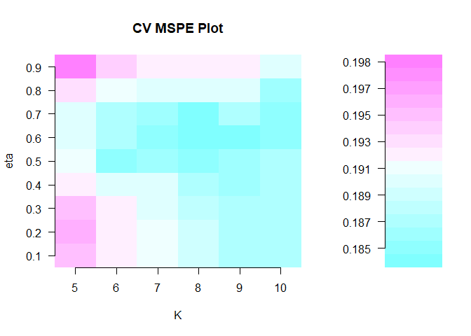
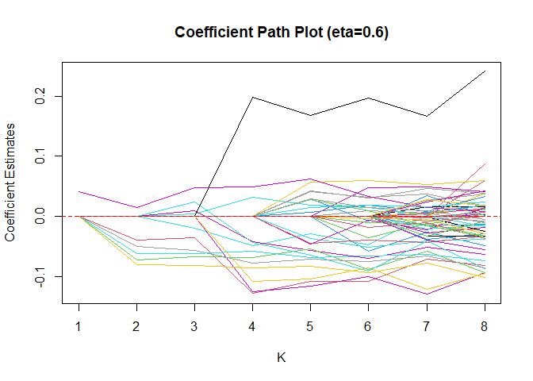

<!-- README.md is generated from README.Rmd. Please edit that file -->

# `spls`: Sparse Partial Least Squares (SPLS) Regression and Classification

<!-- badges: start -->

[](https://cran.r-project.org/package=spls)
[](https://github.com/valentint/spls/actions/workflows/R-CMD-check.yaml)
[](https://app.codecov.io/gh/valentint/spls?branch=master)
[](https://app.codecov.io/gh/valentint/spls)
[](https://cran.r-project.org/package=spls)
[](https://cran.r-project.org/package=spls)
[](https://www.gnu.org/licenses/gpl-3.0.en.html)

<!-- badges: end -->

The package `spls` Provides functions for fitting a sparse partial least
squares (SPLS) regression and classification (Chun and Keles (2010)
<doi:10.1111/j.1467-9868.2009.00723.x>).

## Installation

The `spls` package is on CRAN (The Comprehensive R Archive Network) and
the latest release can be easily installed using the command

    install.packages("spls")
    library(spls)

## Building from source

To install the latest stable development version from GitHub, you can
pull this repository and install it using

    ## install.packages("remotes")
    remotes::install_github("valentint/spls", build_opts = c("--no-build-vignettes"))

Of course, if you have already installed `remotes`, you can skip the
first line (I have commented it out).

## Example

``` r
library(spls)
#> Sparse Partial Least Squares (SPLS) Regression and
#> Classification (version 2.3-0)
data(yeast)
yeast$x[1:5, 1:5]
#>       ABF1_YPD    ACE2_YPD      ADR1_YPD  ARG80_YPD   ARG81_YPD
#> 21  -0.2722730  0.21932294  0.9238359567 -0.4755756 -0.10389318
#> 41   0.1691280  0.53831198  0.0097604993 -0.3219534 -0.19750606
#> 71  -0.1388962  0.02636382  0.0877516229 -0.2234093  0.10307741
#> 78  -0.2865169 -0.31409427 -0.0454998435  0.3262217  0.27757502
#> 102 -0.4950561 -0.14827419  0.0002987512 -0.2179458 -0.02539585
yeast$y[1:5, 1:5]
#>   alpha0 alpha7 alpha14 alpha21 alpha28
#> 1  -0.36  -0.42    0.29   -0.14   -0.19
#> 2   1.04   0.19    0.47   -1.03   -0.63
#> 5  -0.30  -0.45    0.75    0.37    0.27
#> 8  -0.46   0.12   -0.06   -0.76   -0.70
#> 9  -1.35  -0.86   -0.22   -0.38   -0.65

## Tuning parameters
set.seed(1)
cv <- cv.spls( yeast$x, yeast$y, eta = seq(0.1,0.9,0.1), K = c(5:10) )
#> eta = 0.1 
#> eta = 0.2 
#> eta = 0.3 
#> eta = 0.4 
#> eta = 0.5 
#> eta = 0.6 
#> eta = 0.7 
#> eta = 0.8 
#> eta = 0.9 
#> 
#> Optimal parameters: eta = 0.6, K = 8
```

<!-- -->

``` r

## SPLS fit
f <- spls( yeast$x, yeast$y, eta = cv$eta.opt, K = cv$K.opt )
print(f)
#> 
#> Sparse Partial Least Squares for multivariate responses
#> ----
#> Parameters: eta = 0.6, K = 8, kappa = 0.5
#> PLS algorithm:
#> pls2 for variable selection, simpls for model fitting
#> 
#> SPLS chose 56 variables among 106 variables
#> 
#> Selected variables: 
#> ACE2_YPD ARG80_YPD   ARG81_YPD   ASH1_YPD    AZF1_YPD    
#> BAS1_YPD CBF1_YPD    CHA4_YPD    CRZ1_YPD    FHL1_YPD    
#> FKH1_YPD FKH2_YPD    FZF1_YPD    GAT1_YPD    GAT3_YPD    
#> GCN4_YPD GCR2_YPD    GLN3_YPD    HAA1_YPD    HAP2_YPD    
#> HAP5_YPD HIR1_YPD    HIR2_YPD    IME4_YPD    INO4_YPD    
#> A1..MATA1._YPD   MBP1_YPD    MCM1_YPD    MET4_YPD    MSN2_YPD    
#> NDD1_YPD NRG1_YPD    PHD1_YPD    PHO2_YPD    PUT3_YPD    
#> RCS1_YPD REB1_YPD    RFX1_YPD    RIM101_YPD  RME1_YPD    
#> RTG1_YPD RTG3_YPD    SIP4_YPD    SOK2_YPD    STB1_YPD    
#> STE12_YPD    STP2_YPD    SWI4_YPD    SWI5_YPD    SWI6_YPD    
#> THI2_YPD YAP1_YPD    YAP6_YPD    YAP7_YPD    YFL044C_YPD 
#> YJL206C_YPD  

plot.spls( f, yvar=1 )
```

<!-- -->

``` r

coefplot.spls( f, nwin=c(2,2), xvar=c(1:4) )
```

<!-- -->

## Community guidelines

### Report issues and request features

If you experience any bugs or issues or if you have any suggestions for
additional features, please submit an issue via the
[*Issues*](https://github.com/valentint/spls/issues) tab of this
repository. Please have a look at existing issues first to see if your
problem or feature request has already been discussed.

### Contribute to the package

If you want to contribute to the package, you can fork this repository
and create a pull request after implementing the desired functionality.

### Ask for help

If you need help using the package, or if you are interested in
collaborations related to this project, please get in touch with the
package maintainer.
